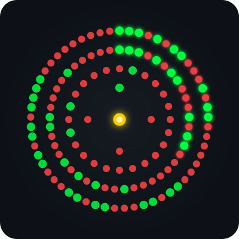

<h1 align="center">
  
</h1>

  

---

## 🧑‍💻 About Me

🎂 **<!-- AGE:START -->15<!-- AGE:END --> years old** &nbsp;·&nbsp; 📍 **Surabaya, Indonesia** 🇮🇩

*Self-Taught Developer & AI Enthusiast*

<blockquote>

💬 *I’m a developer who loves building complex automation systems and experimenting with Local AI and Computer Vision. I started coding to automate games — stayed for the AI.*

</blockquote>

**🌱 Currently Learning**

- 🤖 Machine Learning & Artificial Intelligence
- 👁️ Computer Vision & Image Processing
- 🔐 Cybersecurity & Ethical Hacking
- 📡 IoT & Embedded Systems (Arduino)

**⚡ Fun Facts**

- 🧠 Deployed local LLMs with **7B+ parameters** on my own machine
- 🎮 I build bots that solve puzzles better than I can
- 🛠️ I believe the best way to learn is to **build something crazy**

  
  

---

## 💻 Tech Stack

#### Languages

#### Frameworks & Runtime

#### Tools & Platforms

---

## 🚀 Projects & Skills Showcase

<table align="center">
  <tr>
    <td align="center" width="33%">
      <h3>🤖 Mega Automation Bots</h3>
      
Engineered highly complex automation bots for MMO strategy games, chess platforms, and algorithmic puzzles using advanced pathfinding algorithms and finite state machines.

    </td>
    <td align="center" width="33%">
      <h3>🧠 Machine Learning & AI</h3>
      
Deployed and integrated heavy local AI models including LLMs (7B parameters), Convolutional Neural Networks for OCR, and custom NLP implementations — all running locally.

    </td>
    <td align="center" width="33%">
      <h3>🖥️ Rich Desktop Apps</h3>
      
Developed complex, theme-aware GUI applications for productivity and hardware monitoring with features like local font parsing and real-time data visualization.

    </td>
  </tr>
  <tr>
    <td width="33%"></td>
    <td align="center" width="33%">
      <h3>🌀 Custom Radial Encoding System</h3>
       
      <picture>
        
      </picture>
        
      
I built my own visual encoding system from scratch! It encodes data into a circular pattern of colored nodes (Green=1, Red=0) structured in concentric rings. It features a dynamic marker system, checksum parity, and a decoder that uses <b>OpenCV</b> to calibrate orientation via an anchor ring, read metadata, and extract the encoded bytes. The animation above encodes my name <b>"Tacco"</b>.

    </td>
    <td width="33%"></td>
  </tr>
</table>

---

## 📊 GitHub Stats

  
  

  

---

## 🏆 GitHub Trophies

  

---

## 🔝 Top Contributed Repo

  

---

## 🎮 Contribution Graph

  <picture>
    <source media="(prefers-color-scheme: dark)" srcset="https://raw.githubusercontent.com/Toca-Toca/Toca-Toca/pacman-output/puzzle-bobble-contribution-graph-dark.svg?game=puzzle-bobble">
    <source media="(prefers-color-scheme: light)" srcset="https://raw.githubusercontent.com/Toca-Toca/Toca-Toca/pacman-output/puzzle-bobble-contribution-graph.svg?game=puzzle-bobble">
    
  </picture>

---

## ✍️ Random Dev Quote

  

---

  <i>✨ "The best way to predict the future is to build it." ✨</i>

